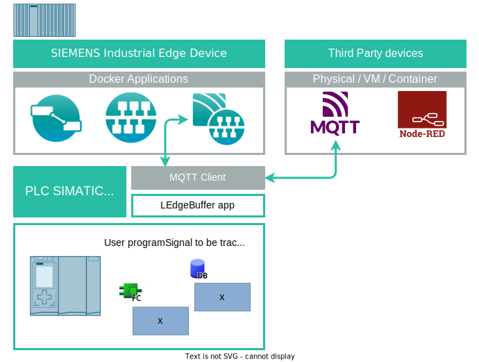

# How to sample high frequency signals from a PLC to Edge Computing applications via MQTT (Using Node-RED, SIMATIC PLC and MQTT)

This document will take you through the basic steps and configuration of components required to set up a PLC program with the SIEMENS library "LEdgeBuffer" to  record and send high frequency signals' data to an edge computing application using MQTT and Node-RED or SIEMENS Industrial Flow Creator.

The document intends to provide a quick start guide for testing the library locally with any SIMATIC PLC S7-1500 and Node-RED/SIEMENS Industrial Flow Creator.

* Tutorial
  * [Description](#description)
    * [Overview](#overview)
    * [General Task](#general-task)
  * [Requirements](#requirements)
    * [Prerequisites](#prerequisites)
    * [Used components](#used-components)
  * [Installation Guide](#installation-guide)
  * [User Manual](#user-manual)
  * [Documentation](#documentation)
  * [Contribution](#contribution)
  * [Licence and Legal Information](#licence-and-legal-information)

## Description

The SIMATIC library "LEdgeBuffer" allows creating a local buffer in the PLC to sample high speed signals (i.e. sampling period = 1ms). This buffer can be sent/read via MQTT, while the recording job can be accessed and controlled via HTTP.

The PLC library functions (FCs) work together with a Node-RED flow. This flow interacts with the PLC variables of the library to start the recording process and then collects the recorded data. The interaction is done by reading a datablock via OPC-UA, and then writing to it via HTTP, working as an interface for the PLC application and the user consuming the data from the buffer.

The Node-RED flow works as a gateway to publish the data from the PLC as a JSON file that can be sent to other devices via i.e. MQTT.

### Overview

This how-to has been created as a straight forward example to sample PLC signals to the Edge environment in an asynchronous way, but preserving their timestamps as well. 

The purpose is to guide PLC users into the steps to connect their signals into the application "LEdgeBuffer" for the use case of reading the signals remotely and processing them into the Edge.

### General Task

The general task of this how to, is to trace signals from a machine or user program, and transfer the trace data (timestamps and values) to a higher level application for further processing or long-term storage in a database.

## Requirements

### Prerequisites

User should be familiar with:
* Node-Red / Flow Creator
* PLC programming
* TIA Portal >=V16
* MQTT

### Used components

* Industrial Edge App Publisher 
* Docker Engine 
* Docker Compose
* Databus (>= V2.3.1-2)
* External Databus (>= V2.0.0-3)
* Flow Creator (>= V1.16.0-2) 
* S7 Connector (>= V2.0.0-1)
* Industrial Edge Device IE Runtime (>= V1.12.0-3)
* TIA Portal  (>= V18)
* PLC: CPU 1515TF-2 PN FW  (>= V3.0.3)

If the user cannot get a SIEMENS industrial edge system, this example can also be done using Node-RED (with minor adjustments to some nodes)

For installing node-red check the next link:
* [Node-RED installation](https://nodered.org/docs/getting-started/local)

## Installation Guide

1. Firstly, the user must import the PLC library into their PLC application. see this link: Library [SIMATIC: S7-1500 – LEdgeBuffer](https://support.industry.siemens.com/cs/document/109783979)

2. A fork of this github repository must be created 

3. Open *Node-Red Editor* with browser (authenticate if necessary)

4. Press button on top-right corner, and go to Projects-->New (or ctrl-alt-n)

5. Choose **Clone Repository**, and input the  Git repository URL of your fork

6. Authenticate using preconfigured SSH keys or HTTPS access tokens

7. After the succcessful clone, **restart** *Node-Red* internally (refreshing the webpage or restarting flows is not enough)

8. Go back to *Node-Red Editor*, press button on top-right corner, and go to Projects-->Project settings-->Dependencies

9. Press install for each of the packages shown in the **Dependencies** tab (should appear after previous restart)

10. Go to the MQTT-Configuration node, and enter the login info under the **Security** tab. (for successful MQTT connection)

11. Then go to the MQTT-In node, and replace the topic property with your respective PLC topic. 

12. Press **Deploy** and go to "https://{domain_name}:{port}/ui" (or ctrl-shift-d)  for accessing the dashboard    (Replace name and port with your own)

Now you are ready to use the dashboard UI to communicate with the LEdgeBuffer application! If any of the steps are not working, please open an *issue* about it.

## User Manual

After installing, head to the Flow Creator Dashboard/UI tab which was opened during  installation. Follow these steps for the normal workflow of the app:

1. Open the tabs on the left bar, and open the "Signal selector"  tab

2. If the default parameters for HTTP login didn't work, please enter the valid parameter data and press the "Login" button (make sure Authentication  was  successful)

3. If the OPC-UA indicators are wrong, change them as necessary

4. Then under the "Setting" group, press the "Get PLC tags" button and wait for the LED indicator to turn green again.  Then go to the dropdowns for each variable slot, and choose the relevant signals to be traced, or just press the "Set Default Values" button for selecting the first few variables in each list. Once the status  indicator is green again go to the other tab.

5. Once in the "Application control and dashboards" tab, adjust the trace length in units of seconds, and then enable the buffer by enabling the radio button. If its led indicator under it  is green, start the trace  by pressing the "Start trace" button.

6. After  a few seconds, the graphs will start to update continuously for the given amount of  time. Wait until the trace is finished, and make sure the led indicators on the right (under "Data diagnostics" group) are all green. 

7. The trace  has been successfully saved, and  can be forwarded to other devices and apps (must be extended internally in Node-Red)

## Documentation

Documentation of the library can be found in the SIEMENS SIOS entry [SIMATIC: S7-1500 – LEdgeBuffer](https://support.industry.siemens.com/cs/document/109783979)

## Contribution

Thank you for your interest in contributing. Anybody is free to report bugs, unclear documentation, and other problems regarding this repository in the Issues section. Everybody is free to propose any changes to this repository using Pull Requests.

If you haven't previously signed the [Siemens Contributor License Agreement](https://cla-assistant.io/industrial-edge/) (CLA), the system will automatically prompt you to do so when you submit your Pull Request. This can be conveniently done through the CLA Assistant's online platform.
Once the CLA is signed, your Pull Request will automatically be cleared and made ready for merging if all other test stages succeed.

## Licence and Legal Information

Please read the [Legal information](LICENSE.md).
